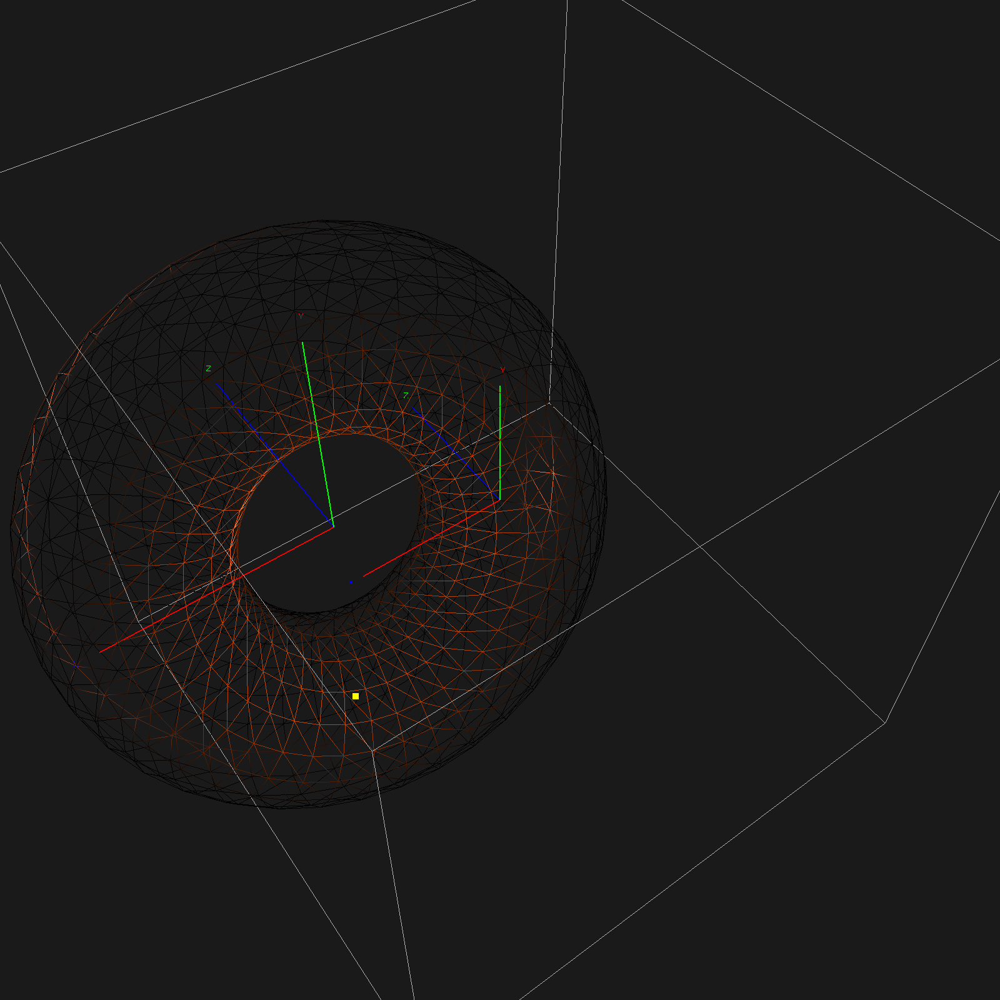

# BMSTU. Computer Graphics


This course is about OpenGL and computer graphics theory.
We had to implement some basic functions with pure math.

This repo contains my PyOpenGL labs. Although I covered only the basics, the last Spining Torus [lab](./lab6-7-8) took some time.

Each lab has a pdf report as usually.
## Set up

```bash
python3 -m venv venv
source venv/bin/activate
pip install -r requirements.txt
```

## Lab 6-7-8

```bash
python lab6-7-8/main.py
```

Spinning Torus

### Controls

| **Категория**              | **Клавиша**         | **Действие**                                                   |
|---------------------------|---------------------|----------------------------------------------------------------|
| **Общее управление**      | `SPACE`             | Включить/выключить анимацию                                   |
|                           | `R`                 | Сброс позиции тора, скорости, масштаба и поворота сцены       |
|                           | `ESCAPE`            | Закрыть программу                                              |
| **Поворот сцены**         | `H`                 | Повернуть сцену влево по оси Y                                 |
|                           | `L`                 | Повернуть сцену вправо по оси Y                                |
|                           | `J`                 | Повернуть сцену вниз по оси X                                  |
|                           | `K`                 | Повернуть сцену вверх по оси X                                 |
| **Поворот тора**          | `RIGHT`             | Повернуть тор вправо по оси Y                                  |
|                           | `LEFT`              | Повернуть тор влево по оси Y                                   |
|                           | `UP`                | Повернуть тор вверх по оси X                                   |
|                           | `DOWN`              | Повернуть тор вниз по оси X                                    |
| **Перемещение тора**      | `W`                 | Сдвинуть тор вверх по оси Y                                    |
|                           | `S`                 | Сдвинуть тор вниз по оси Y                                     |
|                           | `A`                 | Сдвинуть тор влево по оси X                                    |
|                           | `D`                 | Сдвинуть тор вправо по оси X                                   |
|                           | `Q`                 | Сдвинуть тор вперёд по оси Z                                   |
|                           | `E`                 | Сдвинуть тор назад по оси Z                                    |
| **Масштаб тора**          | `Z`                 | Увеличить масштаб на 10%                                       |
|                           | `X`                 | Уменьшить масштаб на 10%                                       |
| **Режим полигона**        | `M`                 | Переключение между каркасом и заполненной отрисовкой          |
| **Текстура**              | `T`                 | Включить/выключить использование текстур                      |
| **Скорость анимации**     | `=` (`EQUAL`)       | Увеличить скорость анимации на 10%                             |
|                           | `-` (`MINUS`)       | Уменьшить скорость анимации на 10%                             |
| **Свет и материалы**      | `0`                 | Включить/выключить освещение                                  |
|                           | `1`–`5`             | Выбор световых пресетов (0–4)                                  |
|                           | `6`–`8`             | Выбор пресетов материалов (0–2)                                |
| **Доп. отображение**      | `B`                 | Переключить отображение ограничивающего прямоугольника (bbox) |
|                           | `V`                 | Переключить отображение осей координат                         |

### Result



### Bonus

```
           .:::.           
       .:::::::::::.       
     .::::'   `:::::.      
   .::::'       `:::::.    
  ::::           ::::::    
  ::::           ::::::    
  ::::           ::::::    
   `::::.       .::::'     
     `:::::. .:::::'       
       `:::::::::'         
           `'''`           
```
