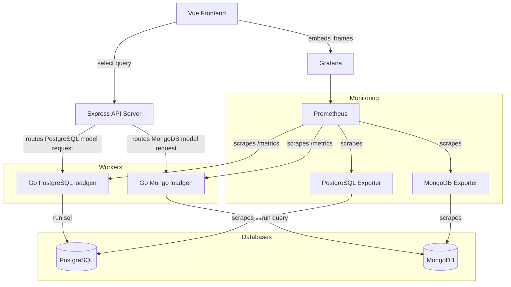

# Architecture

## Overview

## Docker runtime

Frontend собирается как статический Vite bundle в `node:24-alpine`, а в
runtime сервится через `nginx:1.29-alpine`. Node не нужен в frontend runtime,
потому что приложение не использует SSR.

Express API собирается и запускается в `node:24-alpine`. В Docker Compose
сервер слушает `0.0.0.0:1234`, а для обращения к loadgen использует внутренние
адреса `loadgen-postgres:1111` и `loadgen-mongo:1111`.

## Experiment API orchestration

Vue frontend работает только с Express API и не обращается к loadgen напрямую.
Express хранит текущее состояние эксперимента в памяти, валидирует параметры и
выбирает нужный loadgen по модели хранения:

- `pg-jsonb`, `pg-normalized` -> `loadgen-postgres`;
- `mongo-nested`, `mongo-normalized` -> `loadgen-mongo`.

Одновременно выполняется только одно действие эксперимента. Если идет
`clear`, `seed`, `prepare` или `run`, новый запуск отклоняется с HTTP `409`.
Сами операции нагрузки, запись в PostgreSQL/MongoDB и заполнение Prometheus
метрик остаются ответственностью Go loadgen.

Основные endpoint Express:

| Method | Endpoint               | Назначение                                                                |
| ------ | ---------------------- | ------------------------------------------------------------------------- |
| `GET`  | `/api/loadgen/options` | Возвращает модели, сценарии, профили и значения по умолчанию.             |
| `GET`  | `/api/loadgen/status`  | Возвращает состояние текущего или последнего действия.                    |
| `GET`  | `/api/loadgen/stand`   | Возвращает состояние эксперимента, health loadgen-сервисов и Grafana URL. |
| `POST` | `/api/loadgen/clear`   | Очищает данные выбранной модели через нужный loadgen.                     |
| `POST` | `/api/loadgen/seed`    | Заполняет seed-данные выбранной модели.                                   |
| `POST` | `/api/loadgen/prepare` | Последовательно выполняет `clear` и `seed`.                               |
| `POST` | `/api/loadgen/run`     | Запускает эксперимент и возвращает summary и ссылку на Grafana dashboard. |

## Database initialization

Database schemas are initialized by Docker entrypoint scripts mounted from
`src/db/`.

- `src/db/postgres/jsonb` contains the PostgreSQL JSONB schema and indexes.
- `src/db/postgres/normalized` contains the fully normalized PostgreSQL schema
  and indexes.
- `src/db/mongo/nested` contains the nested MongoDB collections, validators,
  and indexes.
- `src/db/mongo/normalized` contains the normalized MongoDB collections,
  validators, and indexes.

The load generator writes and reads data only after these schemas have been
created.
