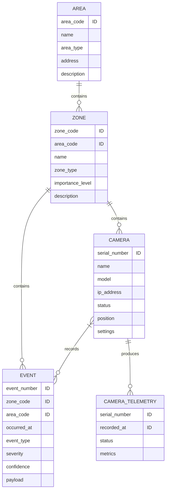

# ER-диаграмма предметной области

ER-модель описывает предметную область системы видеонаблюдения без привязки
к конкретной СУБД и способу физического хранения данных. Справочные значения
типа статусов, типов зон, типов событий и уровней значимости на этом уровне
рассматриваются как домены допустимых значений, а не как отдельные сущности.

Система хранит структуру охраняемых объектов, сведения о камерах, поток
технической телеметрии камер и аналитические события. Одно событие происходит
в зоне наблюдения и может быть зафиксировано одной или несколькими камерами.
Детали события, включая обнаруженные объекты и их атрибуты, рассматриваются
как составная часть события.

## Сущности

### Area

`Area` описывает охраняемую территорию, на которой развернута система
видеонаблюдения.

- `area_code` - идентификатор территории;
- `name` - название территории;
- `area_type` - тип территории, например офис, склад, парковка, кампус или
  промышленный объект;
- `address` - адрес или текстовое описание местоположения;
- `description` - дополнительное описание территории.

Одна территория может содержать несколько зон наблюдения.

### Zone

`Zone` описывает часть охраняемой территории, внутри которой установлены
камеры и фиксируются события.

- `zone_code` - идентификатор зоны внутри территории;
- `area_code` - идентификатор территории, к которой относится зона;
- `name` - название зоны;
- `zone_type` - тип зоны, например вход, парковка, склад, периметр или
  служебное помещение;
- `importance_level` - уровень важности зоны для анализа событий;
- `description` - дополнительное описание зоны.

Одна зона относится к одной территории. В одной зоне может быть установлено
несколько камер, а также может происходить несколько событий.

### Camera

`Camera` описывает камеру видеонаблюдения, установленную в зоне.

- `serial_number` - идентификатор камеры, соответствующий серийному номеру;
- `name` - человекочитаемое название камеры;
- `model` - модель камеры;
- `ip_address` - сетевой адрес камеры;
- `status` - текущее состояние камеры;
- `position` - положение и ориентация камеры внутри зоны;
- `settings` - составные настройки камеры.

Поле `position` может включать координаты установки и углы ориентации камеры.
Поле `settings` может включать параметры видеопотока и аналитики: разрешение,
частоту кадров, битрейт, включенные алгоритмы анализа, зоны детекции и линии
пересечения.

Одна камера относится к одной зоне, формирует множество записей телеметрии и
может фиксировать множество событий.

### Event

`Event` описывает аналитическое событие, возникшее в зоне наблюдения.

- `event_number` - идентификатор события внутри зоны;
- `zone_code` - идентификатор зоны, в которой произошло событие;
- `area_code` - идентификатор территории, к которой относится зона события;
- `occurred_at` - время возникновения события;
- `event_type` - тип события;
- `severity` - уровень значимости события;
- `confidence` - уверенность аналитического алгоритма;
- `payload` - составные данные события.

Поле `event_type` может принимать значения вроде `motion_detected`,
`object_detected`, `line_crossing` или `signal_lost`. Поле `payload` содержит
данные, зависящие от типа события: параметры движения, пересеченную линию,
причину потери сигнала, список обнаруженных объектов, их координаты в кадре и
дополнительные атрибуты.

Одно событие происходит в одной зоне и может быть зафиксировано одной или
несколькими камерами.

### CameraTelemetry

`CameraTelemetry` описывает регулярную запись технического состояния камеры.
Эта сущность хранит историю измерений, а не только текущее состояние камеры.

- `serial_number` - идентификатор камеры;
- `recorded_at` - время фиксации телеметрии;
- `status` - состояние камеры на момент фиксации;
- `metrics` - составные технические показатели камеры.

Поле `metrics` может включать температуру, загрузку процессора, использование
памяти, битрейт, потери пакетов, задержку и время непрерывной работы.

Одна камера может иметь множество записей телеметрии.

## Связи

- `Area` - `Zone`: связь 1:N. Территория может содержать несколько зон, зона
  относится к одной территории.
- `Zone` - `Camera`: связь 1:N. Зона может содержать несколько камер, камера
  относится к одной зоне.
- `Zone` - `Event`: связь 1:N. В зоне может происходить множество событий,
  событие относится к одной зоне.
- `Camera` - `Event`: связь M:N. Камера может фиксировать множество событий,
  событие должно быть зафиксировано одной или несколькими камерами.
- `Camera` - `CameraTelemetry`: связь 1:N. Камера формирует множество записей
  телеметрии.

## Диаграмма

