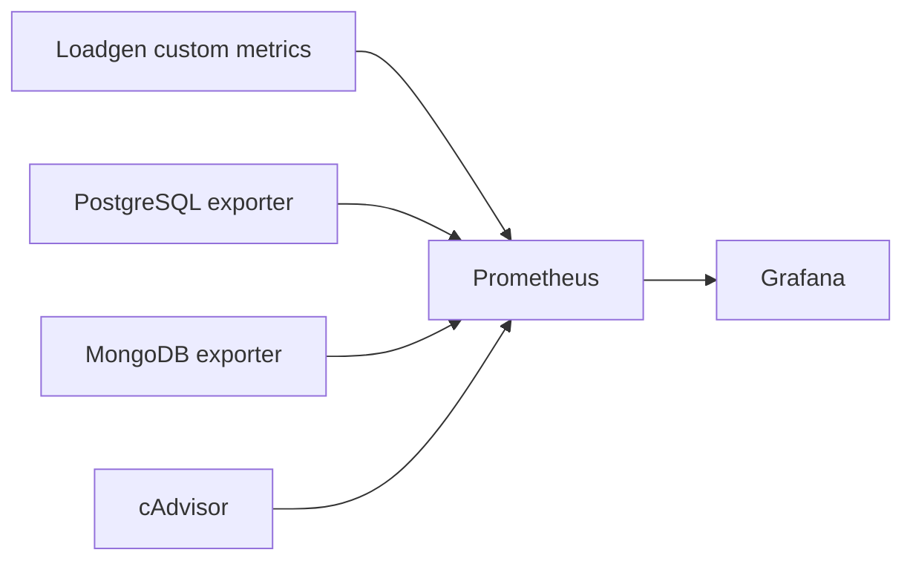

# Метрики нагрузочного тестирования

Документ описывает метрики, которые собираются во время эксперимента по
сравнению четырех моделей хранения данных. Метрики нужны для двух уровней
анализа:

- что видит клиент при выполнении конкретной операции;
- что происходит внутри базы данных и контейнера во время этой операции.

Обычные экспортеры PostgreSQL, MongoDB и cAdvisor не заменяют кастомные
метрики loadgen. Они показывают состояние инфраструктуры, но не связывают
нагрузку с конкретной бизнес-операцией и моделью хранения.

## Источники метрик



## Scrape targets

В Prometheus должны быть явно разделены scrape targets. Каждый target отвечает
на свой вопрос и не заменяет остальные.

| Scrape target      | Endpoint                         | Что снимаем                                                                                               | Зачем нужно                                                            | Что не покрывает                              |
| ------------------ | -------------------------------- | --------------------------------------------------------------------------------------------------------- | ---------------------------------------------------------------------- | --------------------------------------------- |
| `loadgen-postgres` | `loadgen-postgres:1111/metrics`  | custom metrics операций PostgreSQL-моделей: latency histogram, throughput, ошибки, batch size, rows/bytes | сравнить конкретные операции между `pg-jsonb` и `pg-normalized`        | внутреннее состояние PostgreSQL и контейнеров |
| `loadgen-mongo`    | `loadgen-mongo:1111/metrics`     | custom metrics операций MongoDB-моделей: latency histogram, throughput, ошибки, batch size, rows/bytes    | сравнить конкретные операции между `mongo-nested` и `mongo-normalized` | внутреннее состояние MongoDB и контейнеров    |
| `postgres`         | `postgres-exporter:9187/metrics` | метрики PostgreSQL: connections, transactions, tuples, blocks, scans, locks, temp files, sizes            | объяснить поведение `pg-jsonb` и `pg-normalized` внутри СУБД           | latency конкретных loadgen-операций           |
| `mongodb`          | `mongodb-exporter:9216/metrics`  | метрики MongoDB: opcounters, connections, WiredTiger cache, scanned docs/keys, data/index size            | объяснить поведение `mongo-nested` и `mongo-normalized` внутри СУБД    | latency конкретных loadgen-операций           |
| `cadvisor`         | `cadvisor:8080/metrics`          | CPU, memory, disk I/O, network I/O контейнеров                                                            | сравнить ресурсную стоимость моделей                                   | бизнес-операции и планы запросов              |

В Docker Compose постоянно подняты два loadgen target: один подключен к
PostgreSQL, второй - к MongoDB. Разделение результатов выполняется labels
`run_id`, `model`, `scenario`, `operation` и `stage_clients`.

## Метки эксперимента

Кастомные метрики loadgen должны иметь общий набор labels, чтобы графики
можно было строить по модели, профилю нагрузки и операции.

Обязательные labels:

| Label           | Значения                                                        | Назначение                            |
| --------------- | --------------------------------------------------------------- | ------------------------------------- |
| `run_id`        | уникальный идентификатор прогона                                | отделение результатов разных запусков |
| `model`         | `pg-jsonb`, `pg-normalized`, `mongo-nested`, `mongo-normalized` | сравнение моделей хранения            |
| `scenario`      | `write-heavy`, `analytics-heavy`, `balanced`                    | сравнение профилей нагрузки           |
| `operation`     | имя операции                                                    | сравнение типов запросов              |
| `stage_clients` | положительное число клиентов; по умолчанию `1`, `5`, `10`, `25`  | сравнение ступеней параллелизма       |

Для счетчиков ошибок и операций дополнительно используется label `status`:

- `success`;
- `error`.

## Кастомные метрики loadgen

### Grafana dashboard

Основной dashboard для эксперимента находится в
`src/grafana/dashboards/loadgen-experiment.json` и называется
`Loadgen Experiment`.

В dashboard используются переменные:

- `run_id`;
- `model`;
- `scenario`;
- `operation`;
- `stage_clients`.

Канонические панели для экспорта на общий frontend:

- `Total Operations`;
- `Error Rate`;
- `Avg Throughput`;
- `Data Processed`;
- `Latency Percentiles by Model`;
- `p95 Latency by Operation`;
- `Throughput by Model`;
- `Throughput by Stage`;
- `Write p95 Latency`;
- `Read and Analytics p95 Latency`.

Панели `Rows/Documents per Second`, `Bytes per Second`, `Average Batch Size`,
`Database Connections`, `Database Storage Size`, `PostgreSQL Transactions` и
`MongoDB Opcounters` используются как диагностический слой для объяснения
результатов эксперимента.

### loadgen_operation_duration_seconds

Тип: `Histogram`.

Измеряет длительность выполнения одной операции loadgen. Это главная метрика
для сравнения времени записи и чтения.

Labels:

- `run_id`;
- `model`;
- `scenario`;
- `operation`;
- `stage_clients`.

Рекомендуемые buckets:

```text
0.001, 0.005, 0.01, 0.025, 0.05, 0.1, 0.25, 0.5,
1, 2.5, 5, 10, 30, 60, 120
```

Такие buckets подходят для тяжелых агрегирующих запросов. Микросекундные
buckets не нужны, потому что сценарии эксперимента работают с большими
наборами данных.

Используется для расчета:

- p50 latency;
- p95 latency;
- p99 latency;
- сравнения latency по моделям;
- сравнения latency по операциям;
- проверки роста задержек при увеличении параллелизма.

### loadgen_operation_total

Тип: `Counter`.

Считает количество выполненных операций.

Labels:

- `run_id`;
- `model`;
- `scenario`;
- `operation`;
- `stage_clients`;
- `status`.

Используется для расчета:

- throughput операций в секунду;
- доли ошибок;
- количества успешных операций на каждой ступени нагрузки.

### loadgen_active_workers

Тип: `Gauge`.

Показывает текущее количество активных worker-ов loadgen.

Labels:

- `run_id`;
- `model`;
- `scenario`;
- `stage_clients`.

Используется для проверки, что фактическая нагрузка соответствует выбранной
ступени параллелизма.

### loadgen_batch_size

Тип: `Histogram` или `Gauge`.

Фиксирует размер batch для операций записи.

Labels:

- `run_id`;
- `model`;
- `scenario`;
- `operation`;
- `stage_clients`.

Используется для объяснения throughput и latency операций:

- `WRITE_COMPLEX_EVENT_BATCH`;
- `WRITE_TELEMETRY_STREAM`.

### loadgen_operation_rows_total

Тип: `Counter`.

Считает количество предметных записей, обработанных операциями.

Labels:

- `run_id`;
- `model`;
- `scenario`;
- `operation`;
- `stage_clients`.

Примеры:

- количество записанных событий;
- количество записей телеметрии;
- количество строк или документов, возвращенных аналитическим запросом.

Метрика нужна, потому что одна операция может обрабатывать разное количество
данных.

### loadgen_operation_bytes_total

Тип: `Counter`.

Считает примерный объем данных, обработанных или возвращенных операцией.

Labels:

- `run_id`;
- `model`;
- `scenario`;
- `operation`;
- `stage_clients`;
- `direction`.

Значения `direction`:

- `request`;
- `response`.

Метрика помогает сравнивать денормализованные и нормализованные модели по
объему передаваемых данных.

## Метрики PostgreSQL

PostgreSQL exporter используется для объяснения поведения моделей
`pg-jsonb` и `pg-normalized`.

Ключевые группы метрик:

| Группа                           | Зачем нужна                              |
| -------------------------------- | ---------------------------------------- |
| connections                      | проверка давления на пул соединений      |
| transactions                     | сравнение write-heavy нагрузки           |
| tuples inserted/updated/deleted  | объем фактических изменений данных       |
| blocks read/hit                  | оценка работы кэша и чтения с диска      |
| index scans / seq scans          | проверка использования индексов          |
| locks / deadlocks                | поиск блокировок при сложной записи      |
| temp files / temp bytes          | выявление тяжелых агрегаций и сортировок |
| database/table/index size        | оценка цены хранения модели              |
| WAL / checkpoints, если доступны | оценка стоимости записи                  |

Особенно важные признаки:

- у `pg-normalized` ожидается больше вставок на одно событие;
- у `pg-jsonb` ожидается больше работы с JSONB при аналитике;
- temp bytes и seq scans помогают объяснить тяжелые агрегирующие запросы;
- table/index size показывает цену нормализации и индексации.

## Метрики MongoDB

MongoDB exporter используется для объяснения поведения моделей
`mongo-nested` и `mongo-normalized`.

Ключевые группы метрик:

| Группа                           | Зачем нужна                                    |
| -------------------------------- | ---------------------------------------------- |
| opcounters                       | количество insert/query/update/delete операций |
| connections                      | давление на пул соединений                     |
| WiredTiger cache                 | влияние кэша на задержки                       |
| query executor scanned docs/keys | оценка эффективности индексов                  |
| collection/data/index size       | цена хранения и индексации                     |
| locks/tickets, если доступны     | конкуренция операций внутри MongoDB            |
| network bytes                    | объем передачи данных между клиентом и БД      |

Особенно важные признаки:

- у `mongo-nested` ожидается больше дублирования, но меньше соединений данных
  при чтении;
- у `mongo-normalized` ожидается больше чтений и `$lookup` при сборке
  агрегированных представлений;
- scanned docs/keys помогает понять, насколько агрегирующие pipeline
  используют индексы;
- data/index size показывает цену денормализации.

## Метрики контейнеров

cAdvisor используется для измерения ресурсной стоимости моделей.

Ключевые группы:

| Группа          | Зачем нужна                                    |
| --------------- | ---------------------------------------------- |
| CPU usage       | сравнение вычислительной стоимости операций    |
| memory usage    | влияние агрегаций, кэшей и больших результатов |
| disk read/write | цена чтения и записи данных                    |
| network rx/tx   | объем передачи данных                          |
| CPU throttling  | проверка, что контейнер не упирается в лимиты  |

Эти метрики особенно важны при интерпретации случаев, когда latency моделей
похожа, но одна модель потребляет заметно больше ресурсов.

## Метрики по операциям

Для каждой операции из `load-scenario.md` фиксируются разные акценты:

| Операция                      | Главные метрики                                                              |
| ----------------------------- | ---------------------------------------------------------------------------- |
| `WRITE_COMPLEX_EVENT_BATCH`   | insert latency, events/sec, disk write, WAL/opcounters, data/index growth    |
| `WRITE_TELEMETRY_STREAM`      | telemetry records/sec, sustained latency, disk write, index growth           |
| `AGG_OBJECT_ACTIVITY_BY_AREA` | query latency, scanned rows/docs, CPU, memory, temp files or blocking stages |
| `AGG_TELEMETRY_HEALTH_WINDOW` | query latency, CPU, memory, disk read, scanned rows/docs                     |
| `READ_INCIDENT_TIMELINE`      | latency, network payload, join/lookup cost, memory, disk read                |

## Prometheus

Для long-running loadgen предпочтительно отдавать метрики через HTTP endpoint
`/metrics`, чтобы Prometheus снимал их напрямую.

Pushgateway не используется: loadgen является долгоживущим HTTP-сервисом, а
не короткой batch-job. Поэтому прямой scrape `/metrics` проще и точнее для
живых графиков Grafana.

Основные latency и throughput метрики должны идти через обычный scrape
loadgen, потому что histogram должен обновляться во время нагрузки.

## Итоговые графики

Минимальный набор графиков Grafana:

- p95 latency по моделям и операциям;
- p99 latency по моделям и операциям;
- throughput по моделям и операциям;
- error rate по моделям;
- active workers по времени;
- CPU/memory контейнеров БД;
- disk read/write контейнеров БД;
- размер данных и индексов;
- PostgreSQL blocks hit/read и temp bytes;
- MongoDB opcounters и scanned docs/keys.

Итоговые таблицы в отчете должны строиться по операциям, а не только по
моделям. Это позволит показать, какая модель выигрывает на сложной записи,
какая - на агрегациях, а какая - на чтении денормализованных представлений.
