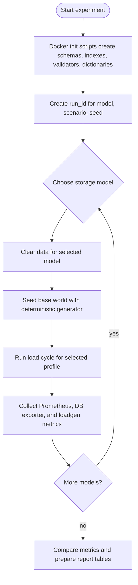
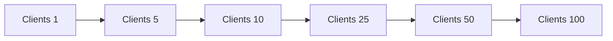

# Сценарий нагрузочного тестирования моделей хранения

Документ описывает сценарий эксперимента для сравнения четырех моделей
хранения данных системы видеонаблюдения:

- PostgreSQL JSONB;
- PostgreSQL normalized;
- MongoDB nested;
- MongoDB normalized.

Цель эксперимента - сравнить поведение моделей на сложной записи,
потоковой записи временных рядов и аналитических запросах по большим
вариативным данным. Модели не нагружаются одновременно: каждый прогон
выполняется отдельно для одной модели, чтобы результаты не искажались
конкуренцией за CPU, память, кэш и диск.

Loadgen запускается из одного Docker-образа с разными параметрами окружения.
В каждый момент времени активен только один тестовый прогон одной модели.
Например, один запуск подключается к PostgreSQL и тестирует `pg-jsonb`,
следующий запуск подключается к PostgreSQL и тестирует `pg-normalized`, затем
отдельные запуски подключаются к MongoDB для `mongo-nested` и
`mongo-normalized`.

## Общий поток тестирования

Схемы баз данных создаются отдельно от нагрузочного генератора. Docker
init-скрипты создают таблицы, коллекции, ограничения, валидаторы, индексы и
справочники. Loadgen не владеет схемой: он только заполняет данные и
выполняет операции эксперимента.

Для PostgreSQL модели разделены схемами в одной базе:

- `jsonb`;
- `normalized`.

Для MongoDB модели разделены базами:

- `coursework_nested`;
- `coursework_normalized`.

## Подготовка данных

Перед нагрузочным циклом loadgen создает базовый мир наблюдения. Генерация
детерминированная: одинаковый `seed` и одинаковый профиль размера должны
давать одинаковые предметные данные для всех четырех моделей.

Базовый мир включает:

- территории;
- зоны наблюдения;
- камеры;
- положения камер;
- настройки видеопотока;
- настройки аналитики;
- области детекции;
- линии пересечения.

События и телеметрия генерируются во время нагрузочных циклов. Такой подход
позволяет разделить стабильную структуру предметной области и потоковые
данные, которые создают основную нагрузку.

Примеры профилей размера:

| Профиль  | Территории | Зоны на территорию | Камеры на зону | Цель                           |
| -------- | ---------: | -----------------: | -------------: | ------------------------------ |
| `small`  |          5 |                  5 |              5 | локальная отладка              |
| `medium` |         20 |                 10 |             10 | основной локальный эксперимент |
| `large`  |         50 |                 20 |             20 | усиленная проверка на стенде   |

## Нагрузочные циклы

Нагрузка задается профилем. Каждый профиль состоит из нескольких ступеней
параллелизма. На каждой ступени loadgen выполняет операции по заданным
долям, собирает latency histogram и счетчики успешных/ошибочных операций.

Рекомендуемая длительность ступени для локального запуска - 60 секунд.
Для итогового эксперимента длительность можно увеличить до 180-300 секунд,
чтобы сгладить влияние коротких всплесков.

Профили нагрузки:

| Профиль           | Запись сложных событий | Запись телеметрии | Агрегация объектов | Агрегация телеметрии | Таймлайн инцидента |
| ----------------- | ---------------------: | ----------------: | -----------------: | -------------------: | -----------------: |
| `write-heavy`     |                    60% |               35% |                 2% |                   2% |                 1% |
| `analytics-heavy` |                    15% |               15% |                30% |                  30% |                10% |
| `balanced`        |                    35% |               35% |                10% |                  10% |                10% |

Каждая модель прогоняется на одинаковом профиле нагрузки и одинаковом seed.
Порядок моделей нужно фиксировать в журнале эксперимента. Если есть риск
влияния прогрева дискового кэша, порядок следует повторить в обратном
направлении и сравнить результаты.

Каждый прогон получает уникальный `run_id`, например
`2026-05-24_15-30_pg-jsonb_write-heavy_seed-42`. Этот идентификатор
передается в loadgen в HTTP-запросе `/run` или генерируется самим loadgen и
добавляется в кастомные метрики. Благодаря этому старые серии Prometheus не
смешиваются с новым прогоном.

Параметр `seed` должен быть положительным целым числом. Значение `0` не
используется, чтобы не смешивать явное значение seed с отсутствующим
параметром.

Пример последовательности:

| Шаг | Target DB  | Model              | Примечание                          |
| --- | ---------- | ------------------ | ----------------------------------- |
| 1   | `postgres` | `pg-jsonb`         | активен только этот прогон          |
| 2   | `postgres` | `pg-normalized`    | запускается после завершения шага 1 |
| 3   | `mongo`    | `mongo-nested`     | запускается после завершения шага 2 |
| 4   | `mongo`    | `mongo-normalized` | запускается после завершения шага 3 |

В Docker Compose постоянно работают два loadgen-сервиса: один для PostgreSQL,
второй для MongoDB. Эксперименты запускаются последовательно через Express API,
чтобы параллельные прогоны не влияли друг на друга, а Prometheus снимает
`/metrics` с обоих loadgen endpoint.

## Операции эксперимента

### WRITE_COMPLEX_EVENT_BATCH

Операция массово записывает аналитические события. Одно событие содержит:

- зону возникновения;
- тип события;
- уровень значимости;
- уверенность алгоритма;
- связь с одной или несколькими камерами;
- типоспецифичный payload;
- массив обнаруженных объектов переменной длины.

Вариативность данных:

- `motion_detected` содержит параметры движения;
- `object_detected` содержит массив объектов;
- `line_crossing` содержит линию, направление и объекты;
- `signal_lost` содержит причину потери сигнала и длительность простоя.

Ожидания:

- PostgreSQL JSONB должен выполнять меньше вставок на одно событие, но хранить
  вариативную часть в JSONB.
- PostgreSQL normalized должен выполнять больше вставок и проверок внешних
  ключей, так как событие раскладывается на базовую таблицу, таблицу связи,
  таблицы деталей и таблицы обнаруженных объектов.
- MongoDB nested должен быть силен на записи цельного документа события.
- MongoDB normalized должен дополнительно записывать связи события и камер в
  `event_cameras`.

Основные метрики:

- events/sec;
- p50/p95/p99 latency batch insert;
- error rate;
- CPU;
- disk write;
- рост размера данных и индексов.

### WRITE_TELEMETRY_STREAM

Операция имитирует поток технической телеметрии от большого числа камер.
Каждая запись содержит:

- камеру;
- время фиксации;
- статус камеры;
- температуру;
- загрузку CPU;
- использование памяти;
- bitrate;
- packet loss;
- latency;
- uptime.

Ожидания:

- PostgreSQL normalized должен получать простые типизированные колонки, но
  платить за индексы и реляционную структуру.
- PostgreSQL JSONB хранит метрики в `metrics JSONB`, что упрощает запись, но
  усложняет последующую аналитику.
- MongoDB nested денормализует камеру, территорию и зону прямо в записи
  телеметрии.
- MongoDB normalized хранит ссылку на камеру, поэтому при аналитике по
  территории или зоне ему потребуются дополнительные чтения или `$lookup`.

Основные метрики:

- telemetry records/sec;
- p50/p95/p99 latency;
- CPU;
- disk write;
- размер временного ряда;
- размер индексов.

### AGG_OBJECT_ACTIVITY_BY_AREA

Операция строит агрегат активности объектов за большой интервал времени.

Бизнес-запрос:

> За период времени по выбранной территории посчитать количество обнаруженных
> объектов по зонам, типам объектов и уровню значимости событий, а также
> среднюю уверенность обнаружения.

Логика запроса:

- выбрать события территории за интервал;
- раскрыть массив обнаруженных объектов;
- сгруппировать по зоне, типу объекта и severity;
- посчитать количество объектов и среднюю confidence.

Ожидания:

- PostgreSQL normalized должен использовать таблицу `detected_object` и
  обычные индексы по связям.
- PostgreSQL JSONB должен раскрывать `event.payload.objects`, что проверяет
  стоимость работы с массивами JSONB.
- MongoDB nested должен агрегировать по встроенным `area`, `zone` и
  `payload.objects` без lookup по территории и зоне.
- MongoDB normalized должен работать с `payload.objects`, но для привязки к
  территории может использовать `$lookup` через `zones` и `areas`.

Основные метрики:

- query latency p50/p95/p99;
- CPU;
- memory;
- disk read;
- количество прочитанных строк или документов;
- наличие временных сортировок и hash/group стадий.

### AGG_TELEMETRY_HEALTH_WINDOW

Операция строит агрегат технического состояния камер по временному окну.

Бизнес-запрос:

> За период времени по выбранной территории найти проблемные камеры: среднюю
> задержку, максимальный packet loss, максимальную температуру и долю времени
> в статусе `signal_lost`.

Логика запроса:

- выбрать телеметрию камер территории за интервал;
- сгруппировать по камере и зоне;
- вычислить агрегаты по метрикам;
- отсортировать камеры по проблемности.

Ожидания:

- PostgreSQL normalized должен быть сильным вариантом, потому что метрики
  представлены типизированными колонками.
- PostgreSQL JSONB должен извлекать числовые значения из `metrics JSONB`.
- MongoDB nested может фильтровать по денормализованным `area` и `zone`.
- MongoDB normalized должен соединять телеметрию с камерами и зонами, если
  агрегат строится по территории.

Основные метрики:

- query latency p50/p95/p99;
- CPU;
- memory;
- disk read;
- scanned rows/docs;
- временные файлы или blocking stages.

### READ_INCIDENT_TIMELINE

Операция собирает временную картину инцидента за большой интервал.

Бизнес-запрос:

> Для выбранной зоны и периода получить события высокой значимости, связанные
> камеры, обнаруженные объекты и агрегированную телеметрию камер в окне около
> времени события.

Логика запроса:

- выбрать `high` и `critical` события зоны за интервал;
- получить камеры, связанные с каждым событием;
- раскрыть объекты события;
- для камер события агрегировать телеметрию в окне около времени события;
- вернуть хронологический таймлайн.

Ожидания:

- MongoDB nested должен быстрее получать само событие, потому что зона,
  территория, камеры и payload уже находятся в документе события.
- PostgreSQL JSONB требует join с зонами, территориями и камерами, но хранит
  payload внутри события.
- PostgreSQL normalized должен показать цену большого числа join, но при этом
  может эффективно использовать структурированные таблицы.
- MongoDB normalized должен показать стоимость ссылочной модели и `$lookup`
  при сборе агрегированного представления.

Основные метрики:

- query latency p50/p95/p99;
- CPU;
- memory;
- network payload size;
- disk read;
- количество join или `$lookup` стадий.

## Метрики сравнения

Для каждой модели и каждого профиля нагрузки фиксируются:

- throughput по операциям;
- p50/p95/p99 latency по операциям;
- error rate;
- CPU базы данных;
- потребление памяти;
- disk read/write;
- размер данных;
- размер индексов;
- количество соединений;
- для аналитических запросов - количество прочитанных строк или документов.

Итоговая таблица сравнения должна строиться отдельно для каждой операции.
Средние значения без percentiles не считаются достаточными, потому что при
нагрузке важны хвостовые задержки.

## Ожидаемая интерпретация результатов

Ожидается, что разные модели будут выигрывать в разных типах нагрузки:

- PostgreSQL JSONB должен быть удобным компромиссом для сложных событий с
  вариативным payload, но может проигрывать на глубокой аналитике по JSONB.
- PostgreSQL normalized должен быть дороже на сложной записи, но сильнее на
  аналитике по типизированным колонкам и связям.
- MongoDB nested должен выигрывать на чтении денормализованных документов и
  записи цельных агрегатов, но платит дублированием данных.
- MongoDB normalized должен лучше сохранять независимость сущностей, но
  аналитические запросы с `$lookup` должны быть дороже, чем во вложенной
  модели.

Эксперимент считается удачным, если каждая операция показывает не только
время выполнения, но и объяснимую причину различий через структуру хранения,
индексы, объем обработанных данных и ресурсные метрики.
