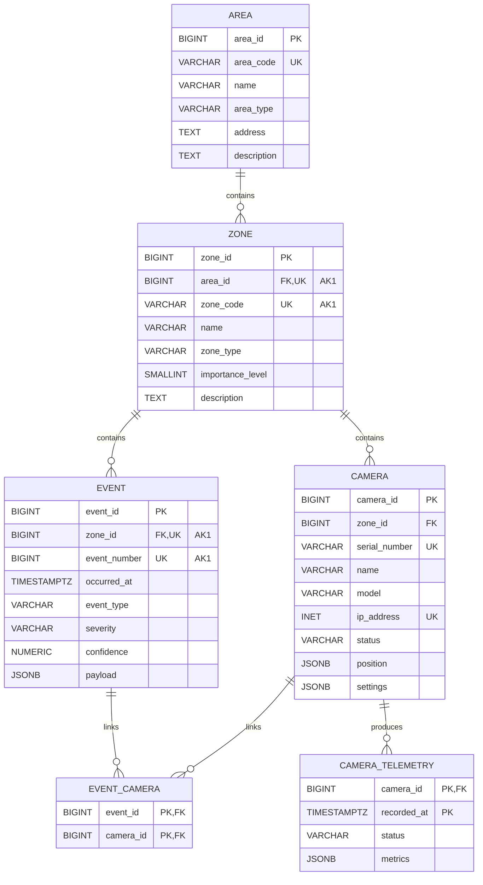

# Реляционная модель PostgreSQL с использованием JSONB

Модель PostgreSQL JSONB строится на основе ER-модели предметной области и
сохраняет основные сущности в отдельных таблицах. Связи между сущностями
реализуются внешними ключами, а составные и вариативные атрибуты хранятся в
полях типа `JSONB`.

Такой вариант является частично нормализованным: стабильные сущности и связи
остаются реляционными, а данные с переменной структурой не раскладываются на
множество вспомогательных таблиц. Это позволяет сравнить хранение вложенных
данных в PostgreSQL JSONB с полностью нормализованной реляционной моделью и
документными моделями MongoDB.

## Домены допустимых значений

Справочные значения в этой модели хранятся в строковых полях и могут быть
ограничены `CHECK`-ограничениями или валидацией на уровне приложения.

- `area_type`: `office`, `warehouse`, `parking`, `campus`,
  `industrial_site`;
- `zone_type`: `entrance`, `parking`, `warehouse`, `perimeter`,
  `service_room`;
- `camera_status`: `active`, `offline`, `maintenance`, `signal_lost`;
- `event_type`: `motion_detected`, `object_detected`, `line_crossing`,
  `signal_lost`;
- `severity`: `low`, `medium`, `high`, `critical`;
- `object_type`: `person`, `vehicle`, `unknown`;
- `direction`: `inside`, `outside`, `left_to_right`, `right_to_left`,
  `unknown`.

## Таблицы

### area

Таблица `area` хранит охраняемые территории.

- `area_id BIGINT PRIMARY KEY` - суррогатный первичный ключ;
- `area_code VARCHAR NOT NULL UNIQUE` - предметный идентификатор территории;
- `name VARCHAR NOT NULL` - название территории;
- `area_type VARCHAR NOT NULL` - тип территории;
- `address TEXT` - адрес или описание местоположения;
- `description TEXT` - дополнительное описание территории.

### zone

Таблица `zone` хранит зоны наблюдения внутри территорий.

- `zone_id BIGINT PRIMARY KEY` - суррогатный первичный ключ;
- `area_id BIGINT NOT NULL REFERENCES area(area_id)` - территория, к которой
  относится зона;
- `zone_code VARCHAR NOT NULL` - предметный идентификатор зоны внутри
  территории;
- `name VARCHAR NOT NULL` - название зоны;
- `zone_type VARCHAR NOT NULL` - тип зоны;
- `importance_level SMALLINT NOT NULL` - уровень важности зоны;
- `description TEXT` - дополнительное описание зоны.

Пара `area_id`, `zone_code` должна быть уникальной, так как код зоны
уникален в пределах территории.

### camera

Таблица `camera` хранит камеры видеонаблюдения.

- `camera_id BIGINT PRIMARY KEY` - суррогатный первичный ключ;
- `zone_id BIGINT NOT NULL REFERENCES zone(zone_id)` - зона установки камеры;
- `serial_number VARCHAR NOT NULL UNIQUE` - серийный номер камеры;
- `name VARCHAR NOT NULL` - название камеры;
- `model VARCHAR NOT NULL` - модель камеры;
- `ip_address INET NOT NULL UNIQUE` - сетевой адрес камеры;
- `status VARCHAR NOT NULL` - текущее состояние камеры;
- `position JSONB NOT NULL` - положение и ориентация камеры;
- `settings JSONB NOT NULL` - настройки видеопотока и аналитики.

#### Структура `camera.position`

```json
{
  "x": 12.5,
  "y": 8.0,
  "z": 3.2,
  "yaw_angle": 90.0,
  "pitch_angle": -12.0,
  "roll_angle": 0.0,
  "view_angle": 110.0
}
```

- `x`, `y`, `z` - координаты камеры внутри зоны;
- `yaw_angle`, `pitch_angle`, `roll_angle` - углы ориентации камеры;
- `view_angle` - угол обзора камеры.

#### Структура `camera.settings`

```json
{
  "stream": {
    "codec": "H.264",
    "resolution_width": 1920,
    "resolution_height": 1080,
    "fps": 25,
    "bitrate_kbps": 4096,
    "rtsp_enabled": true
  },
  "analytics": {
    "motion_detection": true,
    "line_crossing": true,
    "object_detection": true,
    "sensitivity": 0.75,
    "min_object_confidence": 0.6
  },
  "detection_zones": [
    {
      "code": "entrance_area",
      "points": [
        { "x": 10, "y": 20 },
        { "x": 300, "y": 20 },
        { "x": 300, "y": 200 },
        { "x": 10, "y": 200 }
      ]
    }
  ],
  "crossing_lines": [
    {
      "code": "L-01",
      "name": "Entrance line",
      "start": { "x": 120, "y": 40 },
      "end": { "x": 120, "y": 220 },
      "allowed_direction": "outside"
    }
  ]
}
```

Поле `settings` хранит настройки камеры, которые в полностью
нормализованной модели могут быть разложены на отдельные таблицы.

### event

Таблица `event` хранит аналитические события, возникшие в зонах наблюдения.

- `event_id BIGINT PRIMARY KEY` - суррогатный первичный ключ;
- `zone_id BIGINT NOT NULL REFERENCES zone(zone_id)` - зона возникновения
  события;
- `event_number BIGINT NOT NULL` - номер события внутри зоны;
- `occurred_at TIMESTAMPTZ NOT NULL` - время возникновения события;
- `event_type VARCHAR NOT NULL` - тип события;
- `severity VARCHAR NOT NULL` - уровень значимости события;
- `confidence NUMERIC NOT NULL` - уверенность аналитического алгоритма;
- `payload JSONB NOT NULL` - данные события, зависящие от его типа.

Пара `zone_id`, `event_number` должна быть уникальной.

#### Общая структура `event.payload`

```json
{
  "frame_time_ms": 920,
  "objects": [
    {
      "object_type": "person",
      "confidence": 0.91,
      "bounding_box": {
        "x": 120,
        "y": 80,
        "width": 64,
        "height": 180
      },
      "attributes": {
        "direction": "inside",
        "has_bag": true,
        "clothing_color": "dark"
      }
    }
  ]
}
```

Обнаруженные объекты не выделяются в отдельную сущность ER-модели, так как в
рассматриваемом сценарии они не имеют самостоятельного жизненного цикла и
существуют только как часть события. В модели PostgreSQL JSONB они хранятся в
массиве `objects` внутри `event.payload`.

#### `payload` для `motion_detected`

```json
{
  "frame_time_ms": 920,
  "motion_area_percent": 18.5,
  "detection_zone_code": "entrance_area",
  "duration_ms": 2400,
  "objects": []
}
```

#### `payload` для `object_detected`

```json
{
  "frame_time_ms": 1100,
  "objects": [
    {
      "object_type": "vehicle",
      "confidence": 0.87,
      "bounding_box": {
        "x": 420,
        "y": 210,
        "width": 220,
        "height": 120
      },
      "attributes": {
        "color": "white",
        "license_plate": "A123BC",
        "license_plate_confidence": 0.74
      }
    }
  ]
}
```

#### `payload` для `line_crossing`

```json
{
  "frame_time_ms": 1540,
  "line_code": "L-01",
  "direction": "inside",
  "objects": [
    {
      "object_type": "person",
      "confidence": 0.93,
      "bounding_box": {
        "x": 130,
        "y": 70,
        "width": 58,
        "height": 175
      },
      "attributes": {
        "has_bag": false
      }
    }
  ]
}
```

#### `payload` для `signal_lost`

```json
{
  "reason": "network_timeout",
  "last_frame_at": "2026-05-24T12:30:05Z",
  "downtime_seconds": 45
}
```

### event_camera

Таблица `event_camera` реализует связь многие-ко-многим между камерами и
событиями.

- `event_id BIGINT NOT NULL REFERENCES event(event_id)` - событие;
- `camera_id BIGINT NOT NULL REFERENCES camera(camera_id)` - камера,
  зафиксировавшая событие.

Составной первичный ключ таблицы: `event_id`, `camera_id`.
На уровне предметной области событие должно быть связано хотя бы с одной
камерой. В PostgreSQL это требование обеспечивается логикой записи данных или
дополнительным ограничением, так как обычный внешний ключ не выражает
минимальную кардинальность для строки родительской таблицы.

### camera_telemetry

Таблица `camera_telemetry` хранит регулярные записи технического состояния
камер.

- `camera_id BIGINT NOT NULL REFERENCES camera(camera_id)` - камера;
- `recorded_at TIMESTAMPTZ NOT NULL` - время фиксации телеметрии;
- `status VARCHAR NOT NULL` - состояние камеры на момент фиксации;
- `metrics JSONB NOT NULL` - технические показатели камеры.

Составной первичный ключ таблицы: `camera_id`, `recorded_at`.

#### Структура `camera_telemetry.metrics`

```json
{
  "temperature_celsius": 42.5,
  "cpu_load": 0.61,
  "memory_usage": 0.74,
  "bitrate_kbps": 4096,
  "packet_loss": 0.01,
  "latency_ms": 35,
  "uptime_seconds": 86400
}
```

- `temperature_celsius` - температура камеры;
- `cpu_load` - загрузка процессора;
- `memory_usage` - использование памяти;
- `bitrate_kbps` - текущий битрейт видеопотока;
- `packet_loss` - доля потерянных пакетов;
- `latency_ms` - задержка передачи данных;
- `uptime_seconds` - время непрерывной работы камеры.

## Диаграмма


