# Полностью нормализованная реляционная модель PostgreSQL

Полностью нормализованная модель строится на основе ER-модели предметной
области и модели PostgreSQL JSONB. В отличие от JSONB-варианта, составные и
вариативные атрибуты не хранятся в JSON-полях, а раскладываются на отдельные
столбцы и таблицы.

Справочные значения представлены отдельными таблицами. Многозначные и
составные данные, которые в JSONB-модели находятся в `camera.settings`,
`event.payload` и `camera_telemetry.metrics`, представлены отношениями,
связанными внешними ключами.

## Справочные таблицы

Справочные таблицы задают допустимые значения доменов и используются внешними
ключами в основных таблицах.

### area_type

- `area_type_id BIGINT PRIMARY KEY` - идентификатор типа территории;
- `code VARCHAR NOT NULL UNIQUE` - код типа территории;
- `name VARCHAR NOT NULL` - название типа территории.

Допустимые коды: `office`, `warehouse`, `parking`, `campus`,
`industrial_site`.

### zone_type

- `zone_type_id BIGINT PRIMARY KEY` - идентификатор типа зоны;
- `code VARCHAR NOT NULL UNIQUE` - код типа зоны;
- `name VARCHAR NOT NULL` - название типа зоны.

Допустимые коды: `entrance`, `parking`, `warehouse`, `perimeter`,
`service_room`.

### camera_status

- `camera_status_id BIGINT PRIMARY KEY` - идентификатор статуса камеры;
- `code VARCHAR NOT NULL UNIQUE` - код статуса;
- `name VARCHAR NOT NULL` - название статуса.

Допустимые коды: `active`, `offline`, `maintenance`, `signal_lost`.

### event_type

- `event_type_id BIGINT PRIMARY KEY` - идентификатор типа события;
- `code VARCHAR NOT NULL UNIQUE` - код типа события;
- `name VARCHAR NOT NULL` - название типа события;
- `description TEXT` - описание типа события.

Допустимые коды: `motion_detected`, `object_detected`, `line_crossing`,
`signal_lost`.

### event_severity

- `event_severity_id BIGINT PRIMARY KEY` - идентификатор уровня значимости;
- `code VARCHAR NOT NULL UNIQUE` - код уровня значимости;
- `name VARCHAR NOT NULL` - название уровня значимости;
- `rank SMALLINT NOT NULL UNIQUE` - числовой ранг для сортировки.

Допустимые коды: `low`, `medium`, `high`, `critical`.

### object_type

- `object_type_id BIGINT PRIMARY KEY` - идентификатор типа объекта;
- `code VARCHAR NOT NULL UNIQUE` - код типа объекта;
- `name VARCHAR NOT NULL` - название типа объекта.

Допустимые коды: `person`, `vehicle`, `unknown`.

### direction

- `direction_id BIGINT PRIMARY KEY` - идентификатор направления;
- `code VARCHAR NOT NULL UNIQUE` - код направления;
- `name VARCHAR NOT NULL` - название направления.

Допустимые коды: `inside`, `outside`, `left_to_right`, `right_to_left`,
`unknown`.

### video_codec

- `video_codec_id BIGINT PRIMARY KEY` - идентификатор видеокодека;
- `code VARCHAR NOT NULL UNIQUE` - код видеокодека;
- `name VARCHAR NOT NULL` - название видеокодека.

Примеры кодов: `H.264`, `H.265`, `MJPEG`.

### signal_lost_reason

- `signal_lost_reason_id BIGINT PRIMARY KEY` - идентификатор причины потери
  сигнала;
- `code VARCHAR NOT NULL UNIQUE` - код причины;
- `name VARCHAR NOT NULL` - название причины.

Примеры кодов: `network_timeout`, `power_off`, `stream_error`.

## Основные таблицы

### area

Таблица `area` хранит охраняемые территории.

- `area_id BIGINT PRIMARY KEY` - суррогатный первичный ключ;
- `area_type_id BIGINT NOT NULL REFERENCES area_type(area_type_id)` - тип
  территории;
- `area_code VARCHAR NOT NULL UNIQUE` - предметный идентификатор территории;
- `name VARCHAR NOT NULL` - название территории;
- `address TEXT` - адрес или описание местоположения;
- `description TEXT` - дополнительное описание территории.

### zone

Таблица `zone` хранит зоны наблюдения внутри территорий.

- `zone_id BIGINT PRIMARY KEY` - суррогатный первичный ключ;
- `area_id BIGINT NOT NULL REFERENCES area(area_id)` - территория, к которой
  относится зона;
- `zone_type_id BIGINT NOT NULL REFERENCES zone_type(zone_type_id)` - тип
  зоны;
- `zone_code VARCHAR NOT NULL` - предметный идентификатор зоны внутри
  территории;
- `name VARCHAR NOT NULL` - название зоны;
- `importance_level SMALLINT NOT NULL` - уровень важности зоны;
- `description TEXT` - дополнительное описание зоны.

Пара `area_id`, `zone_code` должна быть уникальной.

### camera

Таблица `camera` хранит камеры видеонаблюдения. Составное поле
`camera.position` из JSONB-модели здесь разложено на отдельные столбцы.

- `camera_id BIGINT PRIMARY KEY` - суррогатный первичный ключ;
- `zone_id BIGINT NOT NULL REFERENCES zone(zone_id)` - зона установки камеры;
- `camera_status_id BIGINT NOT NULL REFERENCES camera_status(camera_status_id)`
  - текущий статус камеры;
- `serial_number VARCHAR NOT NULL UNIQUE` - серийный номер камеры;
- `name VARCHAR NOT NULL` - название камеры;
- `model VARCHAR NOT NULL` - модель камеры;
- `ip_address INET NOT NULL UNIQUE` - сетевой адрес камеры;
- `position_x NUMERIC NOT NULL` - координата X;
- `position_y NUMERIC NOT NULL` - координата Y;
- `position_z NUMERIC NOT NULL` - координата Z;
- `yaw_angle NUMERIC NOT NULL` - угол поворота камеры;
- `pitch_angle NUMERIC NOT NULL` - угол наклона камеры;
- `roll_angle NUMERIC NOT NULL` - угол вращения камеры;
- `view_angle NUMERIC NOT NULL` - угол обзора камеры.

## Нормализация настроек камеры

В JSONB-модели настройки камеры хранятся в `camera.settings`. В полностью
нормализованной модели каждая группа настроек вынесена в отдельную таблицу.

### camera_stream_setting

- `camera_id BIGINT PRIMARY KEY REFERENCES camera(camera_id)` - камера;
- `video_codec_id BIGINT NOT NULL REFERENCES video_codec(video_codec_id)` -
  видеокодек;
- `resolution_width INTEGER NOT NULL` - ширина кадра;
- `resolution_height INTEGER NOT NULL` - высота кадра;
- `fps INTEGER NOT NULL` - частота кадров;
- `bitrate_kbps INTEGER NOT NULL` - битрейт;
- `rtsp_enabled BOOLEAN NOT NULL` - признак доступности RTSP-потока.

### camera_analytics_setting

- `camera_id BIGINT PRIMARY KEY REFERENCES camera(camera_id)` - камера;
- `motion_detection BOOLEAN NOT NULL` - включено ли обнаружение движения;
- `line_crossing BOOLEAN NOT NULL` - включено ли обнаружение пересечения
  линии;
- `object_detection BOOLEAN NOT NULL` - включено ли обнаружение объектов;
- `sensitivity NUMERIC NOT NULL` - чувствительность аналитики;
- `min_object_confidence NUMERIC NOT NULL` - минимальная уверенность
  обнаружения объекта.

### camera_detection_zone

- `camera_detection_zone_id BIGINT PRIMARY KEY` - идентификатор области
  детекции;
- `camera_id BIGINT NOT NULL REFERENCES camera(camera_id)` - камера;
- `detection_zone_code VARCHAR NOT NULL` - код области детекции внутри камеры.

Пара `camera_id`, `detection_zone_code` должна быть уникальной.

### camera_detection_zone_point

- `detection_zone_point_id BIGINT PRIMARY KEY` - идентификатор точки области;
- `camera_detection_zone_id BIGINT NOT NULL REFERENCES camera_detection_zone(camera_detection_zone_id)`
  - область детекции;
- `point_order INTEGER NOT NULL` - порядок точки в контуре;
- `x NUMERIC NOT NULL` - координата X в кадре;
- `y NUMERIC NOT NULL` - координата Y в кадре.

Пара `camera_detection_zone_id`, `point_order` должна быть уникальной.

### camera_crossing_line

- `camera_crossing_line_id BIGINT PRIMARY KEY` - идентификатор линии
  пересечения;
- `camera_id BIGINT NOT NULL REFERENCES camera(camera_id)` - камера;
- `allowed_direction_id BIGINT NOT NULL REFERENCES direction(direction_id)` -
  разрешенное направление;
- `line_code VARCHAR NOT NULL` - код линии внутри камеры;
- `name VARCHAR NOT NULL` - название линии;
- `start_x NUMERIC NOT NULL` - координата X начала линии;
- `start_y NUMERIC NOT NULL` - координата Y начала линии;
- `end_x NUMERIC NOT NULL` - координата X конца линии;
- `end_y NUMERIC NOT NULL` - координата Y конца линии.

Пара `camera_id`, `line_code` должна быть уникальной.

## События и камеры

### event

Таблица `event` хранит общие данные аналитических событий. Типоспецифичные
параметры события вынесены в отдельные таблицы деталей.

- `event_id BIGINT PRIMARY KEY` - суррогатный первичный ключ;
- `zone_id BIGINT NOT NULL REFERENCES zone(zone_id)` - зона возникновения
  события;
- `event_type_id BIGINT NOT NULL REFERENCES event_type(event_type_id)` - тип
  события;
- `event_severity_id BIGINT NOT NULL REFERENCES event_severity(event_severity_id)`
  - уровень значимости события;
- `event_number BIGINT NOT NULL` - номер события внутри зоны;
- `occurred_at TIMESTAMPTZ NOT NULL` - время возникновения события;
- `confidence NUMERIC NOT NULL` - уверенность аналитического алгоритма.

Пара `zone_id`, `event_number` должна быть уникальной. Для каждого события
должна существовать запись в одной из таблиц деталей, соответствующей его
типу.

### event_camera

Таблица `event_camera` реализует связь многие-ко-многим между событиями и
камерами.

- `event_id BIGINT NOT NULL REFERENCES event(event_id)` - событие;
- `camera_id BIGINT NOT NULL REFERENCES camera(camera_id)` - камера,
  зафиксировавшая событие.

Составной первичный ключ таблицы: `event_id`, `camera_id`. На уровне
предметной области событие должно быть связано хотя бы с одной камерой; это
требование обеспечивается логикой записи данных или дополнительным
ограничением.

## Детали событий

Таблицы деталей реализуют разные варианты структуры `event.payload` из
JSONB-модели. Они связаны с таблицей `event` отношением 1:1.

### motion_event_detail

Детали события `motion_detected`.

- `event_id BIGINT PRIMARY KEY REFERENCES event(event_id)` - событие;
- `camera_detection_zone_id BIGINT REFERENCES camera_detection_zone(camera_detection_zone_id)`
  - область детекции, если она указана;
- `frame_time_ms INTEGER NOT NULL` - момент кадра;
- `motion_area_percent NUMERIC NOT NULL` - доля области кадра с движением;
- `duration_ms INTEGER NOT NULL` - длительность движения.

### object_detection_event_detail

Детали события `object_detected`.

- `event_id BIGINT PRIMARY KEY REFERENCES event(event_id)` - событие;
- `frame_time_ms INTEGER NOT NULL` - момент кадра.

Сами обнаруженные объекты хранятся в таблице `detected_object`.

### line_crossing_event_detail

Детали события `line_crossing`.

- `event_id BIGINT PRIMARY KEY REFERENCES event(event_id)` - событие;
- `camera_crossing_line_id BIGINT NOT NULL REFERENCES camera_crossing_line(camera_crossing_line_id)`
  - пересеченная линия;
- `direction_id BIGINT NOT NULL REFERENCES direction(direction_id)` -
  фактическое направление пересечения;
- `frame_time_ms INTEGER NOT NULL` - момент кадра.

### signal_lost_event_detail

Детали события `signal_lost`.

- `event_id BIGINT PRIMARY KEY REFERENCES event(event_id)` - событие;
- `signal_lost_reason_id BIGINT NOT NULL REFERENCES signal_lost_reason(signal_lost_reason_id)`
  - причина потери сигнала;
- `last_frame_at TIMESTAMPTZ NOT NULL` - время последнего полученного кадра;
- `downtime_seconds INTEGER NOT NULL` - длительность недоступности.

Камера, для которой зафиксирована потеря сигнала, связывается с событием
через таблицу `event_camera`.

## Обнаруженные объекты

Обнаруженные объекты не являются самостоятельной сущностью ER-модели, потому
что не имеют жизненного цикла вне события. В нормализованной модели они
выделены в таблицы как реализация многозначного составного атрибута
`event.payload.objects`.

### detected_object

- `detected_object_id BIGINT PRIMARY KEY` - идентификатор обнаруженного
  объекта;
- `event_id BIGINT NOT NULL REFERENCES event(event_id)` - событие, в котором
  обнаружен объект;
- `object_type_id BIGINT NOT NULL REFERENCES object_type(object_type_id)` -
  тип объекта;
- `object_number INTEGER NOT NULL` - номер объекта внутри события;
- `confidence NUMERIC NOT NULL` - уверенность обнаружения;
- `bounding_box_x INTEGER NOT NULL` - координата X рамки;
- `bounding_box_y INTEGER NOT NULL` - координата Y рамки;
- `bounding_box_width INTEGER NOT NULL` - ширина рамки;
- `bounding_box_height INTEGER NOT NULL` - высота рамки.

Пара `event_id`, `object_number` должна быть уникальной.

### person_object_attribute

Атрибуты объекта типа `person`.

- `detected_object_id BIGINT PRIMARY KEY REFERENCES detected_object(detected_object_id)`
  - обнаруженный объект;
- `direction_id BIGINT REFERENCES direction(direction_id)` - направление
  движения, если оно определено;
- `has_bag BOOLEAN` - наличие сумки;
- `clothing_color VARCHAR` - цвет одежды.

### vehicle_object_attribute

Атрибуты объекта типа `vehicle`.

- `detected_object_id BIGINT PRIMARY KEY REFERENCES detected_object(detected_object_id)`
  - обнаруженный объект;
- `color VARCHAR` - цвет автомобиля;
- `license_plate VARCHAR` - распознанный номер;
- `license_plate_confidence NUMERIC` - уверенность распознавания номера.

Для объектов типа `unknown` отдельная таблица атрибутов не используется.

## Телеметрия камер

### camera_telemetry

Таблица `camera_telemetry` хранит регулярные записи технического состояния
камер. Поле `camera_telemetry.metrics` из JSONB-модели разложено на отдельные
столбцы.

- `camera_id BIGINT NOT NULL REFERENCES camera(camera_id)` - камера;
- `recorded_at TIMESTAMPTZ NOT NULL` - время фиксации телеметрии;
- `camera_status_id BIGINT NOT NULL REFERENCES camera_status(camera_status_id)`
  - статус камеры на момент фиксации;
- `temperature_celsius NUMERIC` - температура камеры;
- `cpu_load NUMERIC` - загрузка процессора;
- `memory_usage NUMERIC` - использование памяти;
- `bitrate_kbps INTEGER` - текущий битрейт;
- `packet_loss NUMERIC` - доля потерянных пакетов;
- `latency_ms INTEGER` - задержка передачи данных;
- `uptime_seconds BIGINT` - время непрерывной работы.

Составной первичный ключ таблицы: `camera_id`, `recorded_at`.

## Диаграмма

```mermaid
erDiagram
    direction LR
    AREA_TYPE {
        BIGINT area_type_id PK
        VARCHAR code UK
        VARCHAR name 
    }

    ZONE_TYPE {
        BIGINT zone_type_id PK
        VARCHAR code UK
        VARCHAR name 
    }

    CAMERA_STATUS {
        BIGINT camera_status_id PK
        VARCHAR code UK
        VARCHAR name 
    }

    EVENT_TYPE {
        BIGINT event_type_id PK
        VARCHAR code UK
        VARCHAR name 
        TEXT description 
    }

    EVENT_SEVERITY {
        BIGINT event_severity_id PK
        VARCHAR code UK
        VARCHAR name 
        SMALLINT rank UK
    }

    OBJECT_TYPE {
        BIGINT object_type_id PK
        VARCHAR code UK
        VARCHAR name 
    }

    DIRECTION {
        BIGINT direction_id PK
        VARCHAR code UK
        VARCHAR name 
    }

    VIDEO_CODEC {
        BIGINT video_codec_id PK
        VARCHAR code UK
        VARCHAR name 
    }

    SIGNAL_LOST_REASON {
        BIGINT signal_lost_reason_id PK
        VARCHAR code UK
        VARCHAR name 
    }

    AREA {
        BIGINT area_id PK
        BIGINT area_type_id FK
        VARCHAR area_code UK
        VARCHAR name 
        TEXT address 
        TEXT description 
    }

    ZONE {
        BIGINT zone_id PK
        BIGINT area_id FK,UK "AK1"
        BIGINT zone_type_id FK
        VARCHAR zone_code UK "AK1"
        VARCHAR name 
        SMALLINT importance_level 
        TEXT description 
    }

    CAMERA {
        BIGINT camera_id PK
        BIGINT zone_id FK
        BIGINT camera_status_id FK
        VARCHAR serial_number UK
        VARCHAR name 
        VARCHAR model 
        INET ip_address UK
        NUMERIC position_x 
        NUMERIC position_y 
        NUMERIC position_z 
        NUMERIC yaw_angle 
        NUMERIC pitch_angle 
        NUMERIC roll_angle 
        NUMERIC view_angle 
    }

    CAMERA_STREAM_SETTING {
        BIGINT camera_id PK,FK
        BIGINT video_codec_id FK
        INTEGER resolution_width 
        INTEGER resolution_height 
        INTEGER fps 
        INTEGER bitrate_kbps 
        BOOLEAN rtsp_enabled 
    }

    CAMERA_ANALYTICS_SETTING {
        BIGINT camera_id PK,FK
        BOOLEAN motion_detection 
        BOOLEAN line_crossing 
        BOOLEAN object_detection 
        NUMERIC sensitivity 
        NUMERIC min_object_confidence 
    }

    CAMERA_DETECTION_ZONE {
        BIGINT camera_detection_zone_id PK
        BIGINT camera_id FK,UK "AK1"
        VARCHAR detection_zone_code UK "AK1"
    }

    CAMERA_DETECTION_ZONE_POINT {
        BIGINT detection_zone_point_id PK
        BIGINT camera_detection_zone_id FK,UK "AK1"
        INTEGER point_order UK "AK1"
        NUMERIC x 
        NUMERIC y 
    }

    CAMERA_CROSSING_LINE {
        BIGINT camera_crossing_line_id PK
        BIGINT camera_id FK,UK "AK1"
        BIGINT allowed_direction_id FK
        VARCHAR line_code UK "AK1"
        VARCHAR name 
        NUMERIC start_x 
        NUMERIC start_y 
        NUMERIC end_x 
        NUMERIC end_y 
    }

    EVENT {
        BIGINT event_id PK
        BIGINT zone_id FK,UK "AK1"
        BIGINT event_type_id FK
        BIGINT event_severity_id FK
        BIGINT event_number UK "AK1"
        TIMESTAMPTZ occurred_at 
        NUMERIC confidence 
    }

    EVENT_CAMERA {
        BIGINT event_id PK,FK
        BIGINT camera_id PK,FK
    }

    MOTION_EVENT_DETAIL {
        BIGINT event_id PK,FK
        BIGINT camera_detection_zone_id FK
        INTEGER frame_time_ms 
        NUMERIC motion_area_percent 
        INTEGER duration_ms 
    }

    OBJECT_DETECTION_EVENT_DETAIL {
        BIGINT event_id PK,FK
        INTEGER frame_time_ms 
    }

    LINE_CROSSING_EVENT_DETAIL {
        BIGINT event_id PK,FK
        BIGINT camera_crossing_line_id FK
        BIGINT direction_id FK
        INTEGER frame_time_ms 
    }

    SIGNAL_LOST_EVENT_DETAIL {
        BIGINT event_id PK,FK
        BIGINT signal_lost_reason_id FK
        TIMESTAMPTZ last_frame_at 
        INTEGER downtime_seconds 
    }

    DETECTED_OBJECT {
        BIGINT detected_object_id PK
        BIGINT event_id FK,UK "AK1"
        BIGINT object_type_id FK
        INTEGER object_number UK "AK1"
        NUMERIC confidence 
        INTEGER bounding_box_x 
        INTEGER bounding_box_y 
        INTEGER bounding_box_width 
        INTEGER bounding_box_height 
    }

    PERSON_OBJECT_ATTRIBUTE {
        BIGINT detected_object_id PK,FK
        BIGINT direction_id FK
        BOOLEAN has_bag 
        VARCHAR clothing_color 
    }

    VEHICLE_OBJECT_ATTRIBUTE {
        BIGINT detected_object_id PK,FK
        VARCHAR color 
        VARCHAR license_plate 
        NUMERIC license_plate_confidence 
    }

    CAMERA_TELEMETRY {
        BIGINT camera_id PK,FK
        TIMESTAMPTZ recorded_at PK
        BIGINT camera_status_id FK
        NUMERIC temperature_celsius 
        NUMERIC cpu_load 
        NUMERIC memory_usage 
        INTEGER bitrate_kbps 
        NUMERIC packet_loss 
        INTEGER latency_ms 
        BIGINT uptime_seconds 
    }

    AREA_TYPE ||--o{ AREA : classifies
    AREA ||--o{ ZONE : contains
    ZONE_TYPE ||--o{ ZONE : classifies

    ZONE ||--o{ CAMERA : contains
    CAMERA_STATUS ||--o{ CAMERA : current_status

    CAMERA ||--|| CAMERA_STREAM_SETTING : has
    VIDEO_CODEC ||--o{ CAMERA_STREAM_SETTING : used_by
    CAMERA ||--|| CAMERA_ANALYTICS_SETTING : has
    CAMERA ||--o{ CAMERA_DETECTION_ZONE : has
    CAMERA_DETECTION_ZONE ||--o{ CAMERA_DETECTION_ZONE_POINT : consists_of
    CAMERA ||--o{ CAMERA_CROSSING_LINE : has
    DIRECTION ||--o{ CAMERA_CROSSING_LINE : allows

    ZONE ||--o{ EVENT : contains
    EVENT_TYPE ||--o{ EVENT : classifies
    EVENT_SEVERITY ||--o{ EVENT : ranks
    EVENT ||--o{ EVENT_CAMERA : links
    CAMERA ||--o{ EVENT_CAMERA : links

    EVENT ||--o| MOTION_EVENT_DETAIL : has
    CAMERA_DETECTION_ZONE ||--o{ MOTION_EVENT_DETAIL : used_in
    EVENT ||--o| OBJECT_DETECTION_EVENT_DETAIL : has
    EVENT ||--o| LINE_CROSSING_EVENT_DETAIL : has
    CAMERA_CROSSING_LINE ||--o{ LINE_CROSSING_EVENT_DETAIL : crossed
    DIRECTION ||--o{ LINE_CROSSING_EVENT_DETAIL : actual_direction
    EVENT ||--o| SIGNAL_LOST_EVENT_DETAIL : has
    SIGNAL_LOST_REASON ||--o{ SIGNAL_LOST_EVENT_DETAIL : explains

    EVENT ||--o{ DETECTED_OBJECT : contains
    OBJECT_TYPE ||--o{ DETECTED_OBJECT : classifies
    DETECTED_OBJECT ||--o| PERSON_OBJECT_ATTRIBUTE : has
    DETECTED_OBJECT ||--o| VEHICLE_OBJECT_ATTRIBUTE : has
    DIRECTION ||--o{ PERSON_OBJECT_ATTRIBUTE : movement

    CAMERA ||--o{ CAMERA_TELEMETRY : produces
    CAMERA_STATUS ||--o{ CAMERA_TELEMETRY : describes
```

