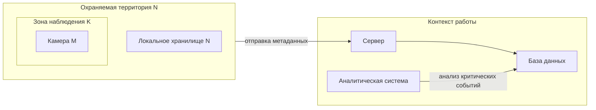

# Сценарий использования системы видеонаблюдения

## Описание системы

```mermaid
flowchart LR
    subgraph Контекст работы
        DB[База данных]
        Server[Сервер]
        Analytics[Аналитическая система]
    end

    subgraph Area[Охраняемая территория N]
        subgraph Zone[Зона наблюдения K]
            Сamera[Камера M]
        end
        Storage[Локальное хранилище N]
    end

    Server --> DB
    Analytics -- анализ критических событий --> DB
    Area -- отправка метаданных --> Server
```
